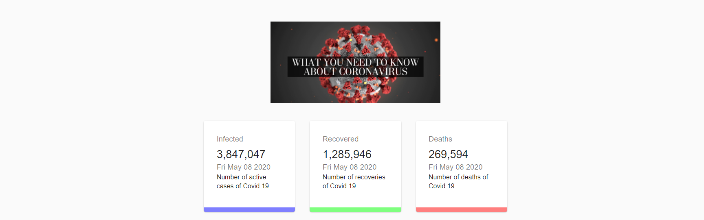
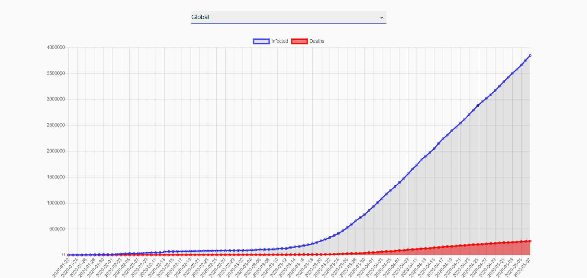
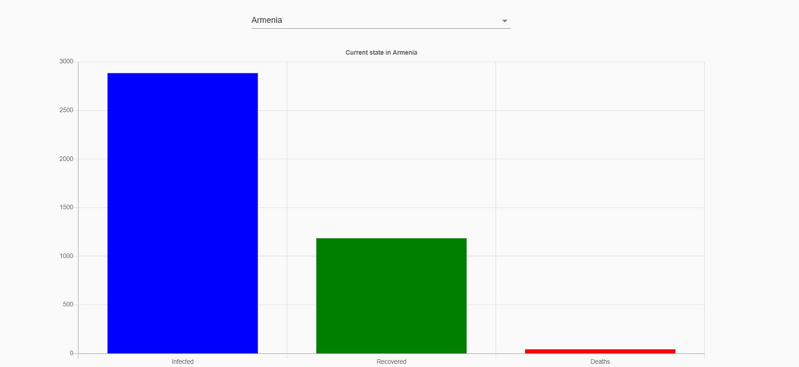

This project was bootstrapped with [Create React App](https://github.com/facebook/create-react-app).
And it is developed using React,Material-UI,Hook,React-Chart.
This CovidTrack app shows the current status of each country's confirmed,deaths and recovered in graph.
1. How to run this app?
   First, git clone the repository
   Second, cd "cloned project folder"
   Third, npm i
   Fourth, npm start
   Then you can see in http://locahost:3000 the app is running.

